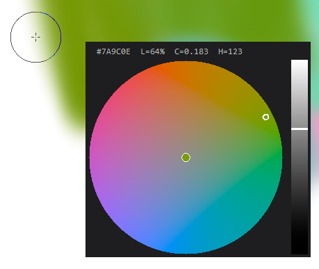
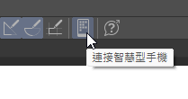

# Luma Palette for Clip Studio Paint

[English](#english) | [繁體中文](#繁體中文)

---

## 🎨 Luma Palette (English)

A Clip Studio Paint color picker that uses the **OKLCH** color space, this allows the artist to easily pick colors to blend that has the same perceived lightness. This color picker can obtain/set the precise brush color by acting as the mobile version of CSP running in Companion Mode. 

  

### ✨ Features
- **OKLCH Color Space**: Provides perceptually uniform lightness across all hues.
- **Auto-Connect**: Just open the "Connect to Smartphone" QR code in CSP, and it will automatically scan your screen and connect.
- **Cursor Integration**: Press `ALT + Left Click` on your canvas to pick a color and instantly summon the palette at your cursor.
- **Fast & Responsive**: Coded purely in Python with optimized matrix rendering (using NumPy), providing you with a lag-free experience without relying on bulky browser technologies.

### 📦 Installation & Usage
1. Make sure you have **Python 3** installed.
2. Double-click the provided `run.bat` script. 
   *(This will automatically install dependencies like `pynput`, `Pillow`, `pystray`, `opencv-python-headless`, and `numpy`, and then run the app).*
3. In Clip Studio Paint, click the **"Connect to smartphone"** icon in the Command Bar to display the QR code.
    
4. Luma Palette will automatically scan your screen, find the QR code, and connect!

### ⌨️ Shortcuts
- **ALT + Left Click (on canvas)**: Sample color & show palette
- **Click / Drag Wheel**: Change hue & chroma (syncs to CSP)
- **Click / Drag Slider**: Change lightness (syncs to CSP)
- **Click anywhere outside the palette**: Close palette
- **System Tray Icon**: Right-click to exit

### 🙏 Acknowledgments
- Thanks to **[Tourbox](https://www.tourboxtech.com/en/news/tourbox-console-5-12-0-dynamic-color-picker.html)** for giving me the idea of faking the mobile version of CSP in companion mode to obtain/set the exact brush color codes.
- Thanks to **[chocolatkey](https://github.com/chocolatkey/clipremote)** for sharing CSP's companion mode encryption/decryption code, saving a lot of headache!

### 📜 License
This project is licensed under the [MIT License](LICENSE) - feel free to use, share, and modify the code.

---

## 🎨 Luma Palette (繁體中文)

這是一個Clip Studio Paint的 **OKLCH** 調色盤，可以讓畫家輕鬆選擇體感明度相同的顏色進行混合(藏色)。

此程式透過模擬手機板 Clip Studio Paint 的「Companion Mode (夥伴模式)」來讀取/更換電腦版CSP筆刷顏色。 

  

### ✨ 主要功能
- **OKLCH 色彩空間**：全色階皆能保持視覺上一致的明度。
- **自動連線**：只要在 CSP 中打開「連接智慧型手機」的 QR Code 畫面，程式會自動掃描螢幕並完成配對連線。
- **游標整合**：在畫布上按下 `ALT + 左鍵`，即可吸取當前顏色，並在游標位置直接喚出色環。
- **極速反應**：純 Python 撰寫並搭配矩陣運算 (NumPy) 優化渲染，無需龐大的瀏覽器核心，帶給您無延遲的操作體驗。

### 📦 安裝與使用方式
1. 請確認您的電腦已安裝 **Python 3**。
2. 雙擊執行 `run.bat`。
   *(此腳本會自動幫您安裝 `pynput`、`Pillow`、`pystray`、`opencv-python-headless`、`numpy` 等必備套件，安裝完成後會直接啟動程式)。*
3. 在 Clip Studio Paint 中，點選命令列的 **「連接智慧型手機」** 圖示，讓畫面上顯示 QR Code。
    
4. Luma Palette 會在背景自動掃描螢幕，找到 QR Code 後就會自動連線！

### ⌨️ 操作快捷鍵
- **ALT + 左鍵 (於畫布上)**：吸取顏色並開啟色環
- **拖曳 / 點擊 色環**：改變色相與彩度並同步至 CSP
- **拖曳 / 點擊 側邊條**：改變明度並同步至 CSP
- **點擊色環外的任意處**：關閉色環
- **系統工作列圖示**：右鍵點選以完全退出程式

### 🙏 特別致謝
- 感謝 **[Tourbox](https://www.tourboxtech.com/en/news/tourbox-console-5-12-0-dynamic-color-picker.html)** 讓我知道可以偽裝成手機板 CSP Companion Mode 來準確獲取/設定電腦CSP畫筆顏色。
- 感謝 **[chocolatkey](https://github.com/chocolatkey/clipremote)** 分享 CSP 的加密/解密協定代碼，省去了一大堆研究協定的時間。

### 📜 授權條款 (License)
本專案採用 [MIT License](LICENSE) 授權 - 歡迎任何人自由分享與修改程式碼
