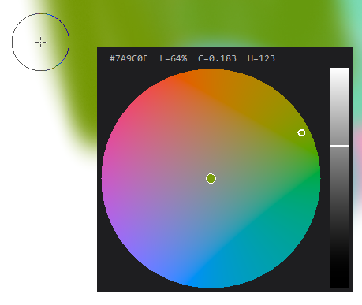
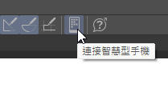
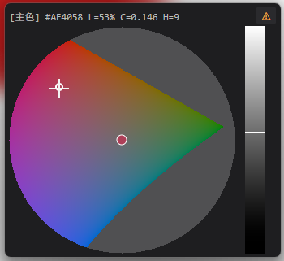
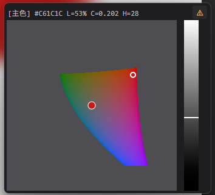

# Luma Palette for Clip Studio Paint

[English](#english) | [繁體中文](#繁體中文)

---

## Luma Palette (English)

Luma Palette is a small Windows color-picker popup for Clip Studio Paint. It
lets you sample the current CSP brush color, adjust it with OKLCH, HSV, HSL, or
Photoshop Lab controls, then sends the selected color directly back to CSP
through Companion Mode.

  

### Install

1. Download the portable app (`.exe`) or installer (`.msi` / setup `.exe`) from
   the [latest release](https://github.com/andyubird/LumaPaletteCSP/releases/latest).
2. Launch Luma Palette.
3. Make sure Clip Studio Paint is running.

Requires Windows 10 or newer. Windows 11 normally includes the WebView2 runtime;
on Windows 10, install WebView2 if the app asks for it.

For portable use, keep the app in a writable folder. Luma Palette saves
`settings.json` and `session.json` beside the `.exe`, so moving the whole folder
also moves your settings and pairing.

### First-Time Pairing

1. In Clip Studio Paint, open `File > Connect to Smartphone`.
2. Keep the Companion Mode QR code visible on screen.
3. Launch Luma Palette. The Status & Settings window will show the connection
   state while Luma Palette scans the screen.
4. After the QR code is found, Luma Palette connects to CSP and saves the
   pairing as `session.json`.
5. After pairing once, Luma Palette will try to reconnect automatically next
   time.

  

### Everyday Use

- `ALT + Left Click` on the CSP canvas samples the color under the cursor with
  CSP's eyedropper, then opens Luma Palette at the cursor. Luma Palette only
  opens for plain `ALT + Left Click`, not `Ctrl + Alt` or other modified clicks.
- If you do not want the palette to open after ALT color picking, turn off
  **Show palette after ALT color pick** in Status & Settings.
- Use **Show palette now** in Status & Settings when you want to open the
  palette without sampling a new canvas color.
- You can enable one custom keyboard shortcut from Status & Settings. There are
  no preset shortcuts; leave it off if you prefer mouse/pen-only use.
- Click or drag on the color area to change hue and colorfulness.
- Click or drag on the vertical slider to change the mode's lightness/value
  axis.
- Click outside the palette to close it.
- Luma Palette reads and writes the currently selected CSP color slot, so edits
  go to the active main or sub color.

### Color Modes

- **OKLCH (perceptual)**: A perceptual color space where the slider controls
  lightness and the wheel controls hue/chroma. This is a good default when you
  want smoother-looking lightness changes and more predictable color variation.
  
  

    
  

  
- **HSV (CSP native)**: Matches the hue, saturation, and value style used by
  CSP's own color controls. This is useful when you want behavior closest to
  CSP's native picker.
  
- **HSL (classic)**: Uses hue, saturation, and lightness. This can be handy for
  quick lighter/darker variations while keeping a familiar color-wheel feel.
  
- **Photoshop Lab**: Uses a Photoshop-style Lab plane. The palette derives `L`
  from the current sampled color, the slider adjusts `L`, and the color area
  adjusts the `a`/`b` color axes.
  
  

    
  

  
- The gamut warning button applies to OKLCH and Photoshop Lab only. HSV and HSL
  already generate displayable sRGB colors, so there are no out-of-gamut areas
  to mark in those modes.

### Status & Settings Window

Click the tray icon, or choose **Status & Settings...** from the tray menu, to
open the settings window.

- **Connection status**: Shows whether Luma Palette is waiting for CSP, scanning
  a QR code, reconnecting, connected, or disconnected.
- **Language**: Switches the settings UI between English and Traditional
  Chinese.
- **Disconnect and scan QR**: Disconnects the current session, removes the saved
  pairing, and starts scanning for a new Companion Mode QR code.
- **Show palette now**: Opens the palette at the cursor without changing the
  saved pairing or settings.
- **Show palette after ALT color pick**: Controls whether Luma Palette opens
  after CSP finishes its own `ALT + Left Click` color pick.
- **Only respond when CSP is focused**: Ignores palette shortcuts and ALT-pick
  behavior while another app is active.
- **Color wheel**: Chooses OKLCH, HSV, HSL, or Photoshop Lab.
- **Palette position**: Chooses where the popup appears relative to the cursor,
  including left-handed and centered positions.
- **Keyboard shortcut**: Enables, records, or clears one custom shortcut for
  opening the palette at the cursor.
- **Storage**: Shows where `settings.json` and `session.json` are stored.

### Tray Menu

Luma Palette stays in the Windows system tray when closed.

- **Left-click tray icon**: Opens Status & Settings.
- **Right-click tray icon**: Opens the quick menu.
- **Only active when CSP is focused**: Toggles whether Luma Palette reacts only
  while Clip Studio Paint is the foreground app.
- **Color wheel**: Quickly switches between OKLCH, HSV, HSL, and Photoshop Lab.
- **Palette offset**: Changes where the palette appears around the cursor.
- **Disconnect and scan QR...**: Clears the saved pairing and scans a new QR
  code.
- **Exit**: Fully quits Luma Palette.

### Troubleshooting

- If Luma Palette does not connect, open `File > Connect to Smartphone` in CSP
  again and choose **Disconnect and scan QR** from the tray menu or settings
  window.
- If settings or pairing do not save, move the portable `.exe` to a writable
  folder such as your Documents folder or a normal app folder outside protected
  system directories.
- If `ALT + Left Click` does nothing, make sure Luma Palette is still running in
  the tray. If **Only active when CSP is focused** is enabled, CSP must be the
  foreground app.
- If the palette shows but the color is stale, wait a moment and sample again;
  CSP sometimes needs a short beat to commit its own eyedropper color.
- If the palette appears in an awkward place on a multi-monitor setup, choose a
  different **Palette position** from Status & Settings or the tray menu.

### Credits

- Companion-mode impersonation idea: Tourbox.
- Reference protocol implementation: chocolatkey/clipremote.
- Protocol notes: [`PROTOCOL.md`](PROTOCOL.md).

Licensed under the [GNU General Public License v3.0 or later](LICENSE).
Forks and redistributed builds must keep the copyright and license notices,
mark modified versions, and provide corresponding source code under the GPL.
Please preserve [`NOTICE`](NOTICE) so users can find and credit the upstream
project.

---

## Luma Palette (繁體中文)

Luma Palette 是一個給 Clip Studio Paint 使用的 Windows 調色盤彈出視窗。它可以讀取
CSP 目前的筆刷顏色，讓你用 OKLCH、HSV、HSL 或 Photoshop Lab 調整，再透過 CSP 的
Companion Mode 直接同步回目前的筆刷顏色。

  

### 安裝

1. 請從
   [最新版本](https://github.com/andyubird/LumaPaletteCSP/releases/latest)
   下載可攜版程式 (`.exe`) 或安裝檔 (`.msi` / setup `.exe`)。
2. 啟動 Luma Palette。
3. 確認 Clip Studio Paint 已開啟。

需要 Windows 10 以上。Windows 11 通常已內建 WebView2 runtime；如果 Windows 10
上啟動時提示需要 WebView2，請依照提示安裝。

若要當作可攜版使用，請把程式放在可寫入的資料夾。Luma Palette 會把
`settings.json` 與 `session.json` 存在 `.exe` 旁邊，因此移動整個資料夾時也會一起
帶著設定與配對資訊。

### 第一次配對

1. 在 Clip Studio Paint 中開啟 `File > Connect to Smartphone`
   （或「連接智慧型手機」）。
2. 保持 Companion Mode 的 QR Code 顯示在螢幕上。
3. 啟動 Luma Palette。Status & Settings 視窗會顯示目前連線狀態，並在背景掃描螢幕。
4. 找到 QR Code 後，Luma Palette 會連線到 CSP，並把配對資訊存成 `session.json`。
5. 完成一次配對後，Luma Palette 下次會嘗試自動重新連線。

  

### 使用方式

- 在 CSP 畫布上按 `ALT + 左鍵`，CSP 會先吸取游標下方顏色，接著 Luma Palette 會在游標旁開啟。
- 如果不想在 ALT 取色後開啟調色盤，可以在系統匣圖示右鍵選單選 Status & Settings 關閉**ALT 取色後顯示調色盤**。
- 想直接開啟調色盤測試，可以使用 Status & Settings 裡的 **立即顯示調色盤**。
- 可以在 Status & Settings 啟用一組自訂鍵盤快捷鍵。程式沒有預設快捷鍵；如果偏好只用滑鼠或筆，也可以保持關閉。
- 在調色盤點擊或拖曳色彩區域可調整色相與色彩強度。
- 在調色盤點擊或拖曳垂直滑桿可調整目前模式的明度或亮度軸。
- 點擊調色盤外側即可關閉調色盤。
- Luma Palette 會讀寫 CSP 目前選取的顏色(主、副色皆可)，選定顏色後會套用到目前的主色或副色。

### 色彩模式

- **OKLCH（感知均勻）**：滑桿控制明度，色盤控制色相與彩度。適合當作預設模式，明度變化
  通常比較平順，調整顏色時也較容易維持一致的視覺感。
  
  

    
  

  
- **HSV（CSP 原生）**：使用 CSP 常見的色相、飽和度、明度方式。適合想要最接近 CSP 內建選色器行為的情況。
  
- **HSL（傳統）**：使用色相、飽和度、亮度。適合快速做偏亮或偏暗的變化，同時保留熟悉的色環操作感。
  
- **Photoshop Lab**：使用類似 Photoshop 的 Lab 色彩空間。開啟時會從目前取到的顏色計算 `L`，垂直滑桿調整 `L`，色彩區域調整 `a` / `b` 色彩軸。
  
  

    
  

  
- 色域警告按鈕只適用於 OKLCH 與 Photoshop Lab。HSV 與 HSL 本身產生的都是可顯示的 sRGB顏色，因此沒有需要標示的超出色域區域。

### Status & Settings 視窗

點擊系統匣圖示，或從系統匣右鍵選單選擇 **Status & Settings...**，即可開啟設定視窗。

- **連線狀態**：顯示目前是等待 CSP、掃描 QR Code、重新連線、已連線或已中斷。
- **語言**：切換設定介面的 English / 繁體中文。
- **中斷並掃描 QR**：中斷目前連線、移除已儲存的配對，並開始掃描新的 Companion Mode QR
  Code。
- **立即顯示調色盤**：在游標旁開啟調色盤，不會改變配對或其他設定。
- **ALT 取色後顯示調色盤**：控制 CSP 完成 `ALT + 左鍵` 取色後，Luma Palette 是否自動開啟。
- **只在 CSP 作用中時回應**：其他程式在前景時，忽略快捷鍵與 ALT 取色行為。
- **色盤模式**：選擇 OKLCH、HSV、HSL 或 Photoshop Lab。
- **調色盤位置**：設定彈出視窗相對於游標的位置，包含左手模式與游標置中。
- **鍵盤快捷鍵**：啟用、錄製或清除一組自訂快捷鍵，用來在游標旁開啟調色盤。
- **儲存位置**：顯示 `settings.json` 與 `session.json` 的位置。

### 系統匣選單

Luma Palette 關閉視窗後會留在 Windows 系統匣中執行。

- **左鍵點擊系統匣圖示**：開啟 Status & Settings。
- **右鍵點擊系統匣圖示**：開啟快速選單。
- **Only active when CSP is focused**：切換是否只在 Clip Studio Paint 是前景程式時才反應。
- **Color wheel**：快速切換 OKLCH、HSV、HSL 與 Photoshop Lab。
- **Palette offset**：變更調色盤出現在游標周圍的位置。
- **Disconnect and scan QR...**：清除已儲存的配對並掃描新的 QR Code。
- **Exit**：完全結束 Luma Palette。

### 疑難排解

- 如果無法連線，請在 CSP 再次開啟 `File > Connect to Smartphone`
  （或「連接智慧型手機」），再從系統匣選單或設定視窗選擇 **中斷並掃描 QR**。
- 如果設定或配對無法保存，請把可攜版 `.exe` 移到可寫入的資料夾，例如 Documents 或一般
  應用程式資料夾，避免放在受保護的系統目錄。
- 如果 `ALT + 左鍵` 沒有反應，請確認系統匣中的 Luma Palette 仍在執行。如果啟用了
  **只在 CSP 作用中時回應**，Clip Studio Paint 必須是目前前景視窗。
- 如果調色盤顯示的顏色不是剛吸到的顏色，請稍等一下再吸一次；CSP 有時需要短暫時間
  才會完成自己的吸色更新。
- 如果在多螢幕環境中調色盤出現在不順手的位置，可從 Status & Settings 或系統匣選單切換
  **調色盤位置**。

### 特別致謝

- 感謝 Tourbox 提供 Companion Mode 模擬手機端以取得 / 設定 CSP 畫筆顏色的靈感。
- 感謝 chocolatkey/clipremote 分享 CSP Companion Mode 解析的部分參考。
- 協定筆記請參考 [`PROTOCOL.md`](PROTOCOL.md)。

本專案採用 [GNU General Public License v3.0 or later](LICENSE) 授權。
衍生版本與重新散布的建置檔必須保留著作權與授權聲明、標示已修改版本，並依 GPL
提供對應原始碼。也請保留 [`NOTICE`](NOTICE)，讓使用者可以找到並標註上游專案。
